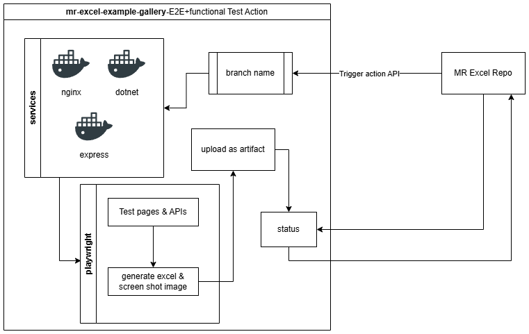

# mr-excel-example-gallery

A comprehensive gallery of Excel generation examples built with [mr-excel](https://github.com/mohammadrezaeicode/mr-excel-repo), demonstrating integration across multiple frontend and backend frameworks. This repository also serves as the end-to-end (E2E) and functional test suite for the MR Excel library.

---

## Overview

This repository showcases how to generate Excel files using `mr-excel` across a variety of technology stacks. Each example is independently runnable and is designed to provide broad coverage of the `mr-excel` schema — spanning static pages, Angular, TypeScript, Express, React, and React with TypeScript.

The gallery is continuously validated through an automated CI pipeline that spins up services, runs Playwright tests against live pages and APIs, and reports results back to the MR Excel repository.

---

## Examples

### Static Page
Excel generation example using plain HTML, CSS, and JavaScript.

### Angular
Excel generation example using Angular.

### TypeScript
Excel generation example using TypeScript.

### Express
Excel generation example using Node.js and Express.

### .NET API (Submodule)
The `excel-validator` directory is a Git submodule pointing to a separate repository that hosts a .NET Web API used exclusively for testing purposes. During the E2E test run, it receives the generated Excel file, validates its content, and renders it as an image for visual verification. It runs as the `dotnet` Docker service. See [Submodules](#submodules) for setup instructions.

### React
Excel generation example using React.

### React + TypeScript
Excel generation example using React and TypeScript.

---

## Architecture

The CI/CD pipeline for this repository is illustrated below:



The ASCII representation of the same flow:

```
MR Excel Repo
    │
    │  Trigger action API (branch name)
    ▼
mr-excel-example-gallery — E2E + Functional Test Action
    │
    ├── Services (Docker)
    │     ├── nginx
    │     ├── dotnet
    │     └── express
    │
    └── Playwright
          ├── Test pages & APIs
          ├── Generate Excel & screenshot images
          │       │
          │       ▼
          │   Upload as artifact
          │
          └── Report status → MR Excel Repo
```

When a branch is pushed to the **MR Excel Repo**, a GitHub Actions workflow triggers this gallery repository via the Actions API, passing the branch name. The gallery then:

1. Checks out the repository including the `excel-validator` submodule.
2. Starts all required Docker services (`nginx`, `dotnet`, `express`).
3. Runs Playwright tests across all example pages and API endpoints.
4. The .NET API validates the generated Excel files and renders them as images for visual verification.
5. Uploads all generated assets as GitHub Actions artifacts.
6. Reports the final pass/fail status back to the originating MR Excel repository.

---

## Submodules

This repository uses a Git submodule for the .NET API service:

| Submodule | Path | Description |
|---|---|---|
| `excel-validator` | `excel-validator/` | .NET Web API used exclusively for testing — validates generated Excel files and renders them as images for visual verification, containerised as the `dotnet` Docker service |

### Cloning with Submodules

When cloning for the first time, include the `--recurse-submodules` flag to pull the submodule alongside the main repository:

```bash
git clone --recurse-submodules https://github.com/mohammadrezaeicode/excel-validator.git
```

If you have already cloned without the flag, initialise and fetch the submodule manually:

```bash
git submodule update --init --recursive
```

### Updating the Submodule

To pull the latest changes from the submodule's upstream repository:

```bash
git submodule update --remote excel-validator
```

Then commit the updated reference in the parent repository:

```bash
git add excel-validator
git commit -m "chore: update excel-validator submodule"
```

### Running the .NET API Locally

```bash
cd excel-validator
dotnet restore
dotnet run
```

The API will be available at `http://localhost:5000` by default. When running via Docker Compose, it is automatically wired into the service network alongside `nginx` and `express`.

---

## Getting Started

### Prerequisites

- [Node.js](https://nodejs.org/) v24
- [.NET SDK](https://dotnet.microsoft.com/download) v8+ (for running the excel-validator submodule locally)
- [Docker](https://www.docker.com/) & Docker Compose
- [Playwright](https://playwright.dev/) (installed via npm)

### Installation

```bash
git clone --recurse-submodules https://github.com/mohammadrezaeicode/excel-validator.git
cd mr-excel-example-gallery
npm install
```

### Running an Example Locally

Navigate to any example folder and follow its own `README` or start script:

```bash
# e.g. React + TypeScript example
cd examples/react-typescript
npm install
npm start
```

### Running Services via Docker

```bash
docker-compose up
```

This starts the `nginx`, `dotnet`, and `express` services required for the full test suite.

### Running E2E Tests

Ensure all Docker services are running before executing the tests:

```bash
docker-compose up -d
```

Then install the Playwright browsers and run the test suite:

```bash
npx playwright install
npx playwright test
```

Playwright drives the test scenarios. The .NET API validates the generated Excel files and renders them as images, which are saved to the `tests/test-results/` directory as visual test evidence.

---

## CI / GitHub Actions

The workflow file at `.github/workflows/e2e+func.yml` defines the full pipeline. It can be triggered:

- **Automatically** via the `repository_dispatch` event from the MR Excel repository.
- **Manually** via `workflow_dispatch` in the Actions tab.

Artifacts (Excel files + screenshots) are retained for 110 days after each run.

---

## Project Structure

```
mr-excel-example-gallery/
JS example
├── CDN/                  # Plain HTML example
├── angular/              # Angular example
├── express/              # Express API 
TypeScript example
├── typescript/           # Standalone 
├── react/                # React example
└── react-typescript/     # React + TypeScript submodule
├── excel-validator/      # Git submodule — .NET API for test validation & image rendering
specs
├── tests/                # Playwright test 
services
├── docker/
│   ├── Dockerfile.express
|   ├── Dockerfile.nginx
├── docker-compose.yml     # Service orchestration
├── .gitmodules            # Submodule configuration
├── .github/
│   └── workflows/
│       └── e2e+func.yml   # CI pipeline definition
└── README.md
```

---

## Contributing

Contributions are welcome! If you'd like to add a new framework example or improve an existing one:

1. Fork the repository.
2. Create a feature branch: `git checkout -b feat/my-example`.
3. Add your example under `examples/` with a self-contained `README`.
4. Submit a pull request describing what was added.

---

## License

MIT 